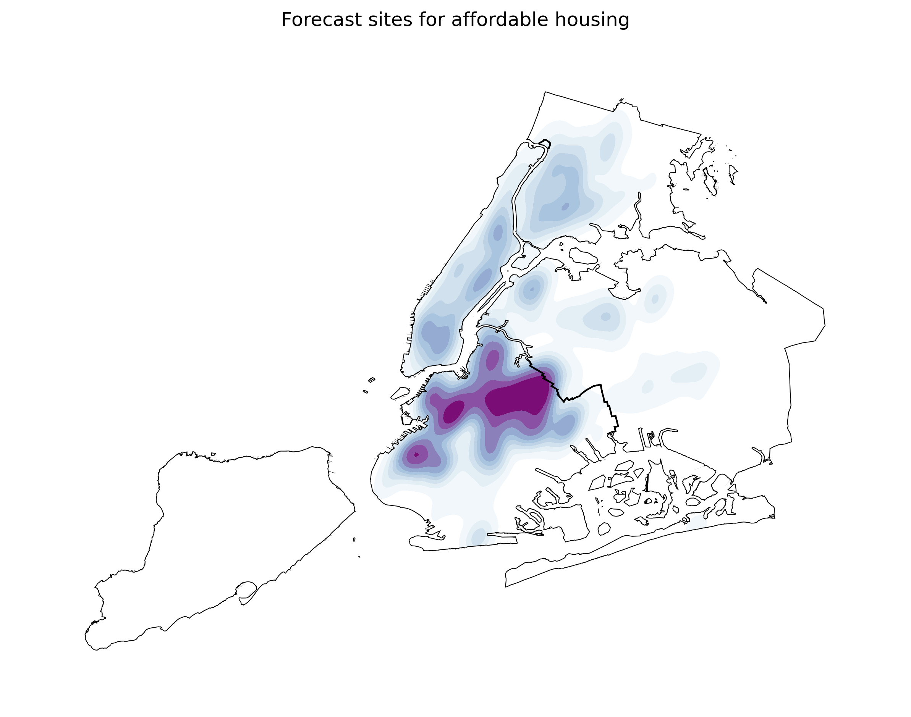
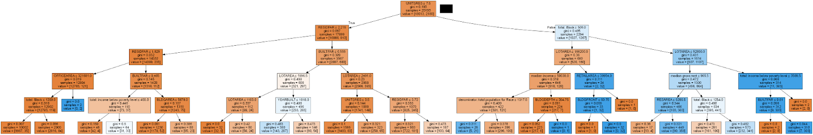
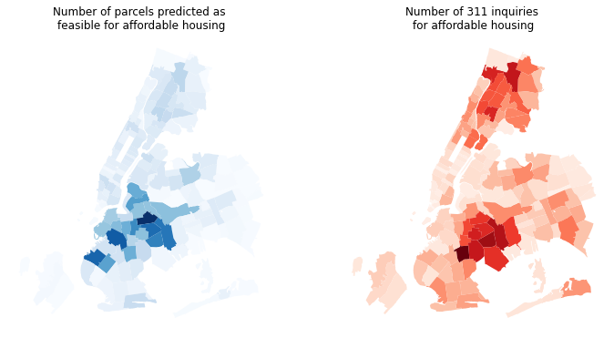
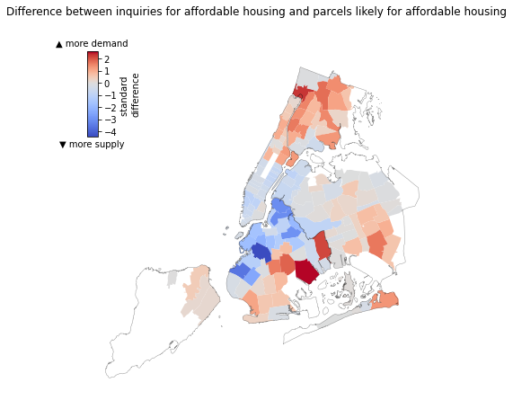

### Challenge:

As New York City faces a growing affordable housing crisis, current programs and policies are not keeping up with the need. The City has an array of different incentives and programs to preserve and develop affordable housing, which were all branded as the Housing New York plan by the de Blasio administration. 

These programs have not added to the housing supply evenly across the city; affordable housing has been concentrated in relatively few neighborhoods. 

In recent decades, NYC Housing Preservation & Development has redeveloped city-owned vacant or underused properties into new affordable housing. However, the City is running out of available sites for new construction, so will need to prioritize areas to acquire property or incentivize private development.

This project forecasts the locations and size of affordable housing construction under the current set of policies and programs. This predicts the outcome of ‘business as usual’ (the current policy mix), indicates neighborhoods with expected concentration or scarcity of affordable housing, and suggests the specific parcel or neighborhood factors that are most associated with housing production or preservation. By comparing these forecasts with indicators of neighborhood housing need, we highlight areas where the new supply of affordable housing will fall short of demand. 

#### Our team
This was a final project for a course in Applied Data Science at the [NYU Center for Urban Science + Progress](https://cusp.nyu.edu). Our collaborative research team included staff from NYC Department of Housing Preservation and Development and NYU master’s students in computer engineering and applied urban science. 

### Findings

#### Most affordable housing is forecast in northern and western Brooklyn

Following the patterns of the Housing New York program, we forecast that most new affordable housing will be located in the several rapidly-changing northern- and western-Brooklyn neighborhoods, especially Bushwick, Downtown Brooklyn, Sunset Park, and Greenpoint. The East Village/Lower East Side; far-eastern Upper East Side; and East Harlem in Manhattan; Astoria and East Elmhurst in Queens; and Morrisania in the central Bronx are also forecast to gain affordable housing.

<!--The neighborhoods demographic variables seem to be the most important in predicting the sites of Housing New York projects, but certain parcel factors are also important. The decision tree classification model found that the neighborhood total Black population and median income to be the most predictive factors (while the building Floor Area Ratio (FAR) and percent of neighborhood residents who are Black were trend features). 

As these demographic factors have been shown to weigh most heavily, it makes sense that our forecasts show the most likely parcels in XX and XX heavy areas including XX and XX neighborhoods.-->

#### Almost no affordable housing in Staten Island or eastern Queens

Our forecasts show almost no affordable housing would be created in all of Staten Island or the eastern half Queens under Housing New York-type programs. This striking result shows the inequities in this program and the various incentive structures that encourage affordable housing only in certain neighborhoods. It is concerning that this programs are unlikely to create affordable housing options in large swaths of the city that may offer lower-income residents greater opportunities in areas where they would have more affluent neighbors. 

#### Local forecast of the scale of production

Our regression forecasts offer a parcel-by-parcel estimate of the likely number of affordable housing units if that property if the property is developed as affordable housing under Housing New York-type programs. These programs include complex sets of incentives for developers, so this estimate of the scale of a ‘typical’ project given the neighborhood dynamics and parcel factors is a valuable indicator and can help planners know what scale of project could be expected at any given location.

This parameterized model could be used for ‘what-if’ and optimization scenarios, e.g. considering how rezoning a parcel or combining or splitting parcels to change the developable size would affect the likely number of units.

#### Expected supply falls short of demand in the East New York, southwest Queens, and the central Bronx

There is generally alignment between the likely locations for affordable housing and the areas with the greatest demand (expressed through 311 inquiries). However there are areas where local demand surpasses the proportional supply. This mismatch is particularly evident in East New York, southwest Queens, and the central Bronx. 

The difference between the inquiries and likely parcels for affordable housing align with the newly released [Disparity Risk Index](https://equitableexplorer.planning.nyc.gov/about). These locations have an intermediate- to high risk for displacement and generally have a higher rent burden than the rest of the city. 

### Technique

#### Data 
We aggregated a broad set of parcel and neighborhood factors which could explain the suitability of a particular property for affordable housing development under the various programs and incentives. These included the physical size and share of the property, its valuation, zoning, and whether it had been recently rezoned, as well as local demographics including median income, and racial and ethnic diversity. 

Census data were pulled through the `cenpy` interface for the Census API (see [notebook](notebooks/get_Census_data.ipynb). Property factors were drawn from NYC Department of City Planning’s [PLUTO](https://www1.nyc.gov/site/planning/data-maps/open-data/dwn-pluto-mappluto.page) database. 

<!-- Rezonings were expected to have an effect on the likelihood that properties properties would include Housing New York Units (particularly since 2016, as under the new [Mandatory Inclusionary Housing](https://www1.nyc.gov/site/planning/plans/mih/mandatory-inclusionary-housing.page) program, any property rezoned over a certain scale must included affordable housing units). Rezonings are not directly indicated in the PLUTO data, but past vintages of the data are published. By recursively comparing zoning codes between years, I was able to find identify property rezonings (whether a property was rezoned within each year and the new zoning district applied) [notebook](notebook). Using a spatial analysis of contiguity then a network analysis of the number of connected components, I was further able to discern which were ‘spot’ rezonings of a single or a few parcels and which were neighborhood-scale (>20 parcel) rezonings [notebook](notebook).-->

Many statistical techniques depend on data consisting of independent and identically distributed (IID) samples. This assumption is often violated by locational data, which is generally spatially autocorellated. Simply, near things are generally more similar to one another than distant things. To account for this spatial dependency, I computed spatially-lagged variables, or, essentially, the mean values at neighboring locations (in this case, the 10 nearest neighbors). Adding spatially-lagged data in machine learning models is a emergent technique (see, e.g., [Liu, et al 2022](https://www.mdpi.com/2220-9964/11/4/242), [Credit 2021](https://onlinelibrary.wiley.com/doi/abs/10.1111/gean.12273)), but one potential way to account for spatial autocorrelation within a machine learning paradigm. 

#### Model building and testing
We used past property factors to predict the actual properties and units that were developed under Housing New York. We used a portion of the data for training various models, used a withheld portion for fine-tuning model parameters, and used a final withheld segment of data for model testing. 

We modeled: 1) _whether_ a property would be included in the Housing New York program at all (classification) and 2) if the property was included, _how many_ units would be preserved or created (regression). Classification models were evaluated on recall score (number of correctly predicted affordable housing properties out of all actual affordable housing properties). Regression models were evaluated on $D^2$ (amount of explained deviance).

A challenge for our classification models is the relatively small number of properties that have been actually developed under Housing New York: just 3,600 out of the city’s more than 671,000 total properties are within the program. We tested various sampling and rebalancing approaches (see e.g. [this evaluation](notebooks/Logistic_Regression_Model_testing_varying_sample_size.ipynb) of the impact of sample size on model recall). After testing several approaches, we found that the [SMOTE](https://arxiv.org/pdf/1106.1813.pdf) technique produced the best result, measured by model recall on withheld test data.  

#### Forecasting
Once we identified the best-performing models by testing on _past_ date, we used _current_ parcel and demographic date to make forecasts of future affordable housing creation. The classification model forecasts the likely sites for Housing New York-type projects and the regression model (see [notebook](notebooks/regression_of_all_counted_units_based_on_parcel_factors.ipynb)) forecasts the probable number of units created if property is developed as newly constructed affordable housing. 

#### Comparing supply and demand 
We used 311 inquiries about affordable housing as a measure of local need for housing. To compare forecast supply and demand, we summed both 311 requests and parcels by ZIP code areas, standardized each count (i.e., computed standard deviations from the mean for each value for each area), and took the difference in standardized values. Areas with positive values have a greater-than-typical number of inquiries for affordable housing compared to the number of local parcels forecast to be suitable for affordable housing. Areas with negative values, in contrast, have a greater portion of parcels indicated as likely for affordable housing, compared to the city average, than their portion of 311 inquiries would recommend
